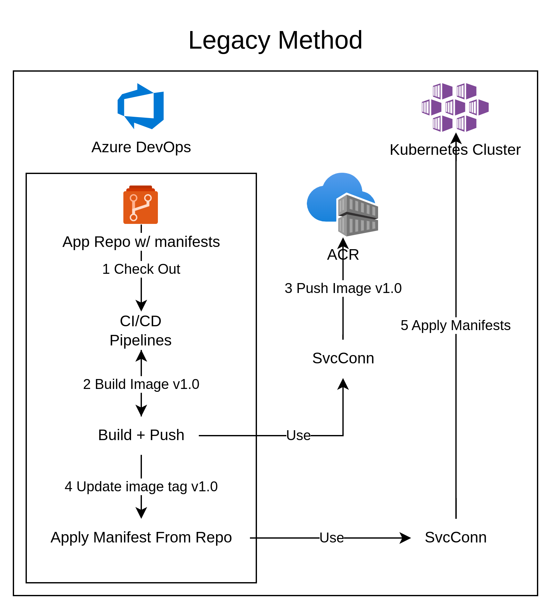
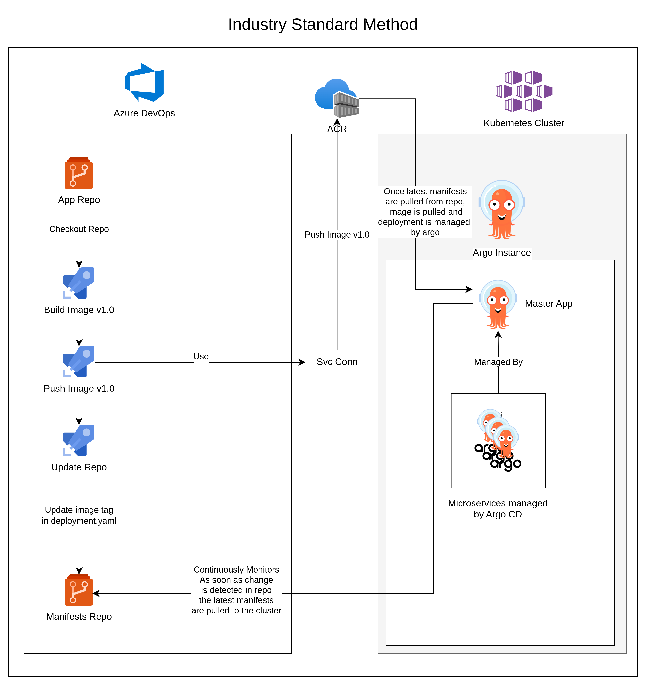

# gitops-with-terraform-argocd-demoapp
This repo contains code for terraform to deploy a AKS k8s cluster that installs argocd and ingress-nginx, then we have a demo-app that we deploy to k8s using argo with the App of Apps Pattern

